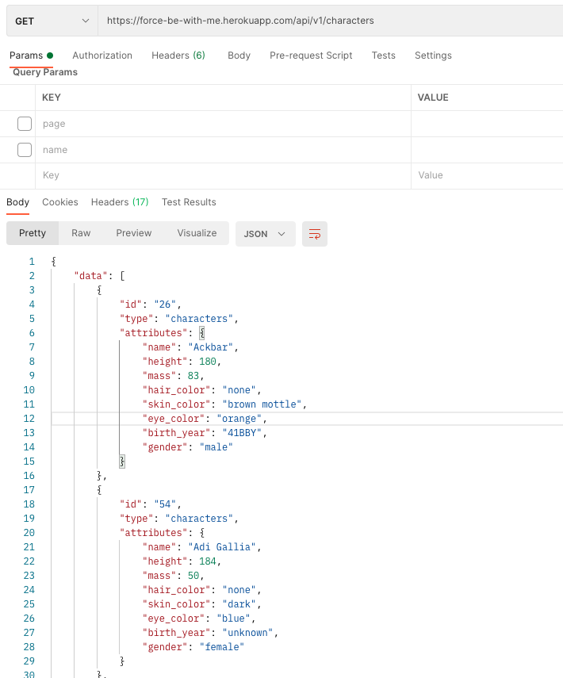
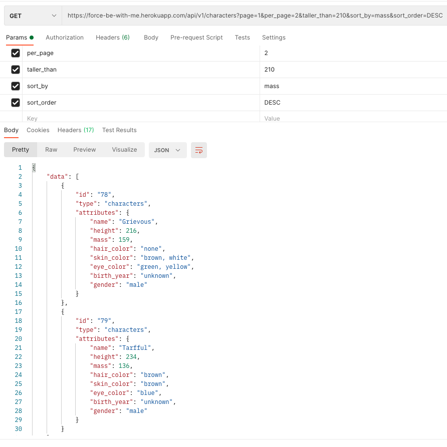
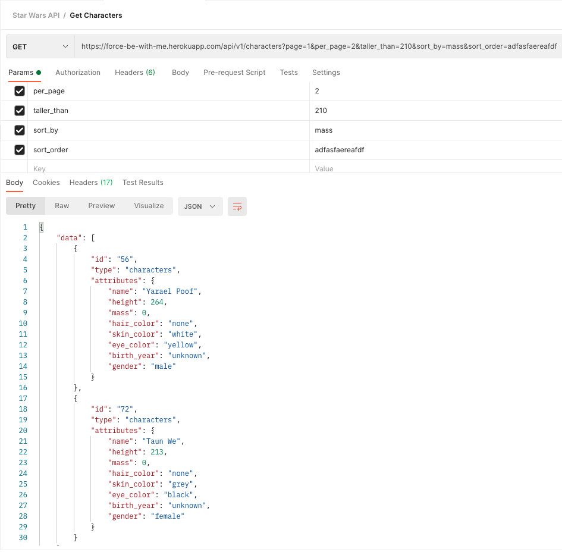
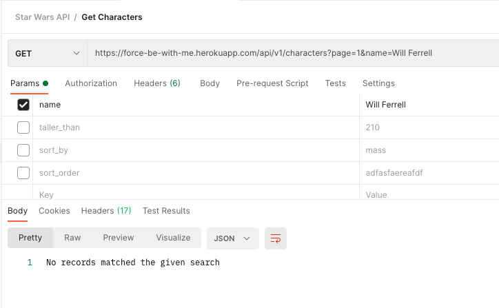
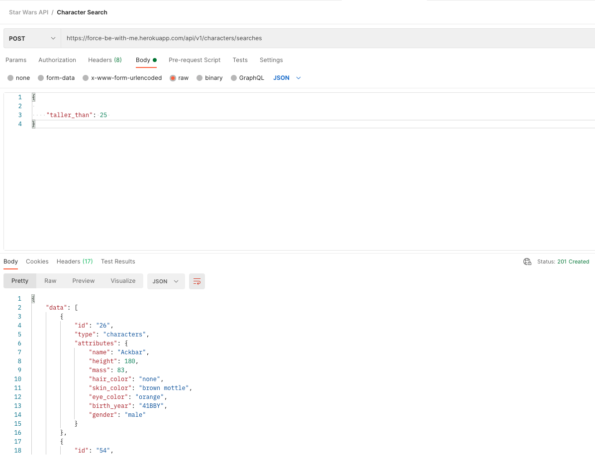
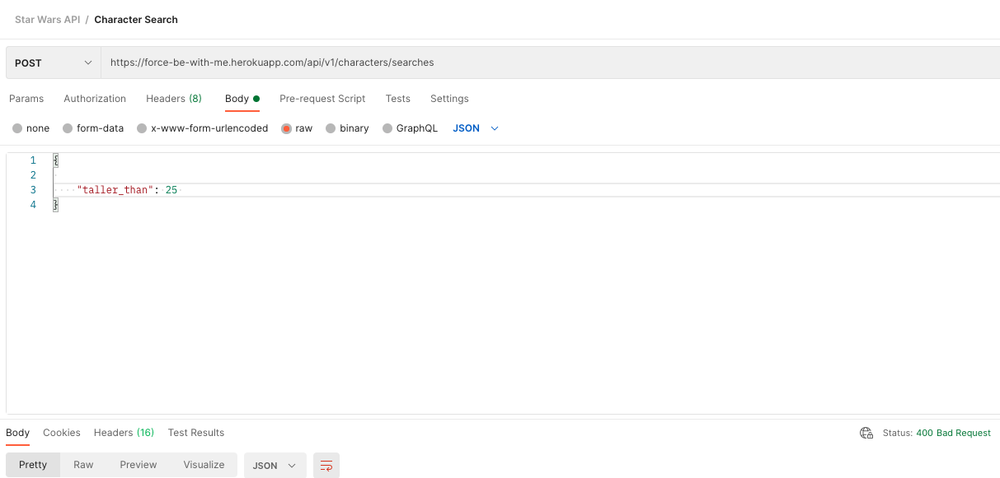
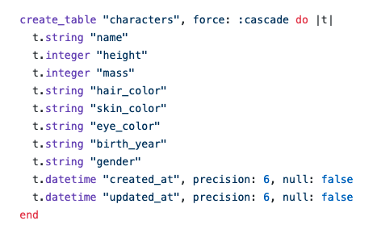
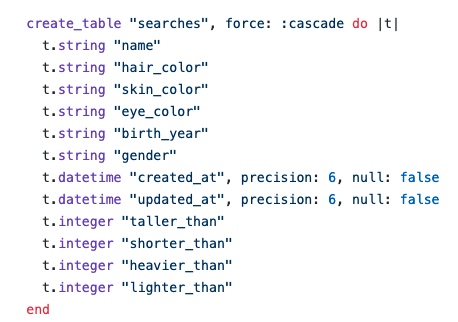

# Force Be With Me

This API consumes an external Star Wars character API and exposes two sortable and filterable endpoints. The endpoints also return paginated results. This app is deployed to Heroku and was built using Ruby on Rails.

## Table of Contents

- [Author](#author)
- [Getting Started](#getting-started)
- [Running Test Suite](#running-tests-suite)
- [Endpoints](#endpoints)
- [Models and Schema](#models-and-schema)
- [Built With](#built-with)
- [Version](#versioning)
- [Reflection](#reflection)

## Author

- **Tommy Nieuwenhuis** -
  [Tommy's GitHub](https://github.com/tsnieuwen)
  [Tommy's LinkedIn](https://www.linkedin.com/in/thomasnieuwenhuis/)

## Getting Started

### Thank you  
Thank you to the folks at `SWAPI` for the use of their public API. Documentation for this API can be found here: https://swapi.dev/

### Prerequisites
- To run this application locally you will need `Ruby 2.5.3` and Rails `6.1.3.2`

### Cloning and Setup

- If you wish to install this repo locally, please fork and clone the following repo:

    `git clone <git@github.com:<your github handle>/force_be_with_me.git>`

- Install the gem packages by running `bundle install`
- Create and seed the database by running `rails db{:create, :migrate, :seed}`

## Running Test Suite
- RSpec was utilized for testing this application and code coverage was confirmed using SimpleCov. Models, facades, services, and requests were all happy and sad path tested. If a sad path unit test is not present, it is because the user would be prevented from an invalid input due to model validations and controller flow.
- To see the tests, run `bundle exec rspec`

## Endpoints

### Get `https://force-be-with-me.herokuapp.com/api/v1/characters`
- This endpoints returns character records from the database. It is sorted as well as paginated. Default sorting is ascending alphabetically by character name, and default pagination is page 1, twenty records per page.

#### Valid Query Parameters
- name
- taller_than
  - if an invalid entry (non-number), defaults to the minimum height in the character table
- shorter_than
  - if an invalid entry (non-number), defaults to the maximum height in the character table
- heavier_than
  - if an invalid entry (non-number), defaults to the minimum mass in the character table
- lighter_than
  - if an invalid entry (non-number), defaults to the maximum mass in the character table
- hair_color
- skin_color
- eye_color
- birth_year
- gender
- sort_by
 - if invalid entry (entry not a character attribute/column), defaults to `name`
- sort_order
  - if invalid entry (not `ASC` or `DESC`), defaults to `ASC`
- per_page
  - defaults to 20 records per page
- page
  - defaults to page 1

#### Example Requests via Postman
- No params default to alphabetically sorted by name, paginated 20 characters per page

- Happy path with valid params

- Sad path. Similiar request to the one above, only `sort_order` request is invalid and defaults to `ASC`

- Sad path. If a record isn't found the the response if a message informing the user.

### Post `https://force-be-with-me.herokuapp.com/api/v1/characters/searches`
- Similar to the `GET` endpoint above, this endpoints returns character records from the database. However, this endpoint also creates a search record within the search table of the database, given the search is unique. It is sorted as well as paginated. Default sorting is ascending alphabetically by character name, and default pagination is page 1, twenty records per page. The same query parameter condition with the `GET` request are applied here. Unlike the `GET` request, the status of the response for the `POST` request is a `201`, since a record is created upon successful request.

#### Example Requests via Postman
- 201 response status when search record is saved

- 400 response status if the search isn't unique and couldn't be saved

## Models and Tables

### Character Model & Table
- The Character model validates for the presence of all attributes in the schema below, and also validates for uniqueness of the name attribute. The table itself is seeded through the `CharacterFacade` and `CharacterService` files, which consume the external StarWars API.

- Character table portion of schema file

### Search Model & Table
- The Search model validates uniqueness of an entire record by scoping. The table is populated via the `post` api request discussed above.

- Search table portion of schema file

## Built With
- Ruby 2.5.3
- Rails 6.1.3.2
- Heroku
- PostgreSQL

## Version
- This is the first verion of the `force-be-with-me` API.

## Reflection
- Things I would like to further explore with this project:
  - Caching
    - Making the app more performant
  - Database refresh
    - It would interesting to implement some sort of refresh for the Characters table in the database, since it is seeded directly from the external API. I considered this before starting the project, however, ultimately decided that Star Wars characters do not change often enough to necessitate  implementing this functionality for MVP. That being said, it seems a new Star Wars spin off is produced frequently enough to consider a annual refresh.
  -Implementing some type of user table or security measures to track who is posting to the searches table.
